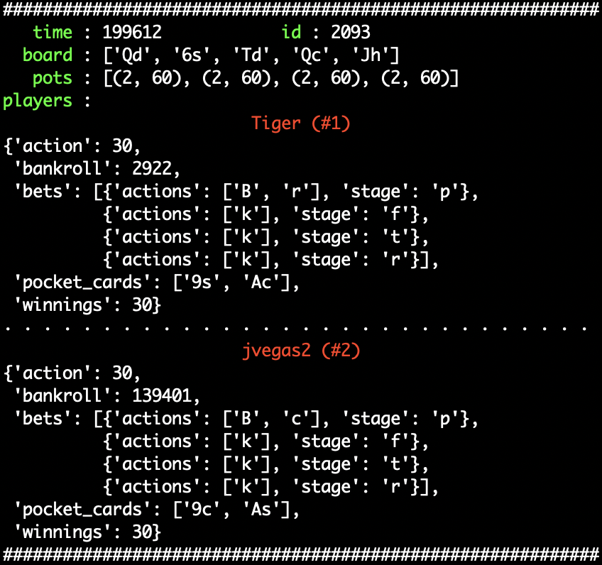

# Poker Hands Dataset

Simple scripts to extract, clean and browse the IRC Poker Database. Note here only hold 'em hands are included. Most (over 95%) hands are dropped either because they're not hold 'em or because of lack of features.

## Data Preparation

Run the following codes in order:

```bash
wget http://poker.cs.ualberta.ca/IRC/IRCdata.tgz  # download the database (-> IRCdata.tgz)
tar -xvf IRCdata.tgz                              # unzip the tgz file (-> IRCdata)
python3 extract.py                                # extract data (-> hands.json)
python3 clean.py                                  # drop invalid hand data (-> hands_valid.json)
```

Eventually there're 10,233,955 hands in `hands.json` and 437,862 in `hands_valid.json` after cleaning.

## Data Inspection

You may run the following code to inspect hands in their original order. Any time you'd like to stop browsing

```bash
python3 browse.py                                 # print hands in a formatted way
```



## References

- [IRC Poker Database](http://poker.cs.ualberta.ca/irc_poker_database.html), Computer Poker Research Group, University of Alberta, 2017.
- [Miami Data Science Meetup](https://github.com/dksmith01/MSDM/blob/987836595c73423b89f83b29747956129bec16c2/.ipynb_checkpoints/MDSM%20Project%201%20Poker%20Python%20Wrangling%20Code-checkpoint.ipynb), 2015.